<!--
    ╔══════════════════════════════════════════════════════════════════════════════════════════════════╗
    ║                                                                                                  ║
    ║     This profile is a carefully constructed experience.                                         ║
    ║     Every element has been considered. Every pixel has purpose.                                 ║
    ║                                                                                                  ║
    ╚══════════════════════════════════════════════════════════════════════════════════════════════════╝
-->

<!-- ═══════════════════════════════════════════════════════════════════════════════════════════════ -->
<!--                                     ANIMATED HEADER                                              -->
<!-- ═══════════════════════════════════════════════════════════════════════════════════════════════ -->


<div align="center">

<!-- ═══════════════════════════════════════════════════════════════════════════════════════════════ -->
<!--                                   TYPING ANIMATION                                               -->
<!-- ═══════════════════════════════════════════════════════════════════════════════════════════════ -->

[](https://git.io/typing-svg)

</div>

<br>

<!-- ═══════════════════════════════════════════════════════════════════════════════════════════════ -->
<!--                               DAILY BHAGAVAD GITA VERSE                                          -->
<!-- ═══════════════════════════════════════════════════════════════════════════════════════════════ -->

<div align="center">


<br><br>

<table>
<tr>
<td align="center" width="800">


```sanskrit
कर्मण्येवाधिकारस्ते मा फलेषु कदाचन।
मा कर्मफलहेतुर्भूर्मा ते सङ्गोऽस्त्वकर्मणि॥
```

<sub>

**"You have the right to work only, but never to its fruits.**
**Let not the fruits of action be your motive, nor let your attachment be to inaction."**

*— Bhagavad Gita, Chapter 2, Verse 47*

</sub>

<br>

<sub>📅 Updates daily via GitHub Actions • Cycles through all 700 verses</sub>

</td>
</tr>
</table>

</div>

<br>

---

<!-- ═══════════════════════════════════════════════════════════════════════════════════════════════ -->
<!--                                      ABOUT ME                                                    -->
<!-- ═══════════════════════════════════════════════════════════════════════════════════════════════ -->

<div align="center">

## 👨‍💻 About Me

</div>

<table>
<tr>
<td width="50%" valign="top">

### 🧠 Philosophy

I don't build apps — I build **infrastructure**.

While most chase the next framework, I descend into the depths where **bits become truth**, where **cache lines determine destiny**, where **memory barriers are laws of physics**.

My philosophy: *If you can't explain the memory layout, you don't understand the system.*

**Target:** Systems/Infrastructure roles at Google, Jane Street, Citadel, Databricks, NVIDIA

</td>
<td width="50%" valign="top">

### ⚡ Current Status

```yaml
📍 Location: Pune, India (UTC+5:30)
🎓 Education: B.Tech CSE (AI & ML) @ VIT Pune
💼 Status: Open for Internships
🎯 Focus: Distributed Systems, HFT, Lock-Free
📚 Reading: "Designing Data-Intensive Applications"
✅ Completed: Titan (12.8M matches/sec)
☕ Fuel: Endless chai
```

</td>
</tr>
</table>

<br>

---

<!-- ═══════════════════════════════════════════════════════════════════════════════════════════════ -->
<!--                                     TECH STACK                                                   -->
<!-- ═══════════════════════════════════════════════════════════════════════════════════════════════ -->

<div align="center">

## 🛠️ Tech Arsenal

<br>

[](https://skillicons.dev)

<br>

[](https://skillicons.dev)

<br><br>

| Domain | Technologies |
|:---:|:---|
| **🔧 Systems** | Tokio, Async Rust, Lock-Free DS, LMAX Disruptor, Raft Consensus, WAL Engines |
| **💾 Storage** | PostgreSQL, Redis, HNSW, LSM Trees, B+ Trees, RocksDB |
| **☁️ Infrastructure** | Docker, Kubernetes, gRPC, AWS, GCP, Linux, io_uring |
| **🧠 ML/DL** | PyTorch, CUDA, TensorFlow, scikit-learn |

</div>

<br>

---

<!-- ═══════════════════════════════════════════════════════════════════════════════════════════════ -->
<!--                                   FLAGSHIP PROJECTS                                              -->
<!-- ═══════════════════════════════════════════════════════════════════════════════════════════════ -->

<div align="center">

## 🏗️ Flagship Projects

*Two systems. Opposite poles. Complete mastery of infrastructure.*

</div>

<br>

<!-- ─────────────────────────────────────────────────────────────────────────────────────────────── -->
<!--                                        VAJRA                                                     -->
<!-- ─────────────────────────────────────────────────────────────────────────────────────────────── -->

<div align="center">

### ⚔️ VAJRA — Distributed Vector Database

  

</div>

<br>

> **The Question:** *How do machines agree on truth when any can fail at any moment?*

```mermaid
flowchart TB
    subgraph Cluster["⚔️ VAJRA CLUSTER"]
        direction TB
        
        subgraph Node1["Node 1 (LEADER)"]
            R1[Raft Engine]
            W1[WAL]
            H1[HNSW Index]
            R1 --> W1 --> H1
        end
        
        subgraph Node2["Node 2 (FOLLOWER)"]
            R2[Raft Engine]
            W2[WAL]
            H2[HNSW Index]
            R2 --> W2 --> H2
        end
        
        subgraph Node3["Node 3 (FOLLOWER)"]
            R3[Raft Engine]
            W3[WAL]
            H3[HNSW Index]
            R3 --> W3 --> H3
        end
        
        Node1 <-->|AppendEntries| Node2
        Node1 <-->|AppendEntries| Node3
        Node2 <-->|RequestVote| Node3
    end
    
    Client([Client]) -->|gRPC| Node1
    
    style Node1 fill:#667eea,color:#fff
    style Node2 fill:#764ba2,color:#fff
    style Node3 fill:#764ba2,color:#fff
    style Client fill:#f093fb,color:#000
```

<br>

<details>
<summary><b>📐 View Architecture Diagram</b></summary>
<br>



</details>

<details>
<summary><b>📋 Technical Specifications</b></summary>
<br>

| Layer | Component | Implementation |
|:---:|:---|:---|
| **Consensus** | Leader Election | Raft with randomized timeouts, PreVote protocol |
| **Consensus** | Log Replication | Pipelined AppendEntries with backpressure |
| **Storage** | WAL | Append-only, fsync on commit, segment compaction |
| **Storage** | Snapshots | Incremental with copy-on-write |
| **Index** | Vector Search | Custom HNSW (M=16, ef=200) |
| **Performance** | Recall | ~99% Recall@1 at sub-ms p99 |
| **Testing** | Chaos | Network partitions, leader kills, disk failures |

</details>

<details>
<summary><b>🔢 Mathematical Proof: Log Matching</b></summary>
<br>

$$\large \forall \, i > 0 : \quad \text{log}[i].\text{term} = \text{peer}[i].\text{term} \implies \text{log}[0..i] \equiv \text{peer}[0..i]$$

*If two logs agree on the term at index i, they are identical for all preceding entries.*

</details>

<br>

<div align="center">

[](https://github.com/DevWizard-Vandan/Vajra)

</div>

<br>

---

<br>

<!-- ─────────────────────────────────────────────────────────────────────────────────────────────── -->
<!--                                        TITAN                                                     -->
<!-- ─────────────────────────────────────────────────────────────────────────────────────────────── -->

<div align="center">

### ⚡ TITAN — Ultra Low-Latency Matching Engine

  

</div>

<br>

A single-threaded, lock-free HFT-style matching engine designed around **cache locality** and **zero-allocation hot paths**.

<br>

<div align="center">

| Metric | Target | **Achieved** |
|:---:|:---:|:---:|
| Insert Throughput | 1M/sec | **12.6M/sec** |
| Match Throughput | 1M/sec | **12.8M/sec** |
| P50 Latency | <20μs | **0ns** |
| P99 Latency | <100μs | **200ns** |

</div>

<br>

<details>
<summary><b>📐 Architecture</b></summary>
<br>



</details>

<details>
<summary><b>🔧 Design Decisions</b></summary>
<br>

```mermaid
flowchart LR
    subgraph Network["Network Layer"]
        N1[Thread 1]
        N2[Thread 2]
        N3[Thread N]
    end
    
    subgraph Core["Core 0 - ISOLATED"]
        RB[("🔥 RING BUFFER\n64K slots\nLock-Free SPSC")]
        
        subgraph ME["Matching Engine"]
            LOB["📊 Order Book"]
            BID["BID SIDE\nMax-Heap"]
            ASK["ASK SIDE\nMin-Heap"]
            LOB --> BID
            LOB --> ASK
        end
        
        RB --> ME
    end
    
    subgraph Output["Output"]
        MD[("📡 Market Data\nZero-Copy Multicast")]
    end
    
    N1 & N2 & N3 --> RB
    ME --> MD
    
    style RB fill:#f093fb,color:#000
    style ME fill:#667eea,color:#fff
    style MD fill:#764ba2,color:#fff
```

| Technique | Implementation |
|:---|:---|
| **LMAX Disruptor** | Lock-free SPSC ring buffer, 128B cache-line padding |
| **Cache Alignment** | 64B Order struct = 1 cache line exactly |
| **Fixed-Point Math** | `Price(u64)`, `Quantity(u64)` — no floats |
| **Zero Allocation** | Pre-allocated `OrderPool` (1M orders) |
| **CPU Isolation** | Single-threaded core, `SCHED_FIFO`, no context switches |
| **Latency Tracking** | HdrHistogram with RDTSC timing |

</details>

<br>

<div align="center">

*When latency is the product, every nanosecond is a design decision.*

<br>

[](https://github.com/DevWizard-Vandan/Titan)

</div>

<br>

---

<br>

<!-- ═══════════════════════════════════════════════════════════════════════════════════════════════ -->
<!--                                    THE DUALITY                                                   -->
<!-- ═══════════════════════════════════════════════════════════════════════════════════════════════ -->

<div align="center">

### 🎭 The Duality

| | **VAJRA** | **TITAN** |
|:---|:---:|:---:|
| **Constraint** | Network-bound | CPU-bound |
| **Problem** | Consensus correctness | Performance correctness |
| **State** | Distributed | Local |
| **Concurrency** | Async Rust (Tokio) | Lock-free primitives |
| **Failure Mode** | Partitions, crashes | Cache misses, branch misprediction |

<br>

*Together, they prove complete mastery of systems infrastructure—*
*from the datacenter to the cache line.*

</div>

<br>

---

<!-- ═══════════════════════════════════════════════════════════════════════════════════════════════ -->
<!--                                   OTHER PROJECTS                                                 -->
<!-- ═══════════════════════════════════════════════════════════════════════════════════════════════ -->

<div align="center">

## 📦 Other Projects

</div>

<br>

<div align="center">
<table>
<tr>
<td align="center" width="25%">
<b>MiniDrive</b><br>
<sub>Hybrid cloud storage</sub><br>


</td>
<td align="center" width="25%">
<b>Predictive Cursor</b><br>
<sub>ML Research • Published</sub><br>


</td>
<td align="center" width="25%">
<b>FixLoop</b><br>
<sub>AI VS Code Extension</sub><br>


</td>
<td align="center" width="25%">
<b>WhisperLink</b><br>
<sub>P2P Privacy Messaging</sub><br>


</td>
</tr>
</table>
</div>

<br>

---

<!-- ═══════════════════════════════════════════════════════════════════════════════════════════════ -->
<!--                                   ACHIEVEMENTS                                                   -->
<!-- ═══════════════════════════════════════════════════════════════════════════════════════════════ -->

<div align="center">

## 🏆 Recognition

<br>


<br><br>


</div>

<br>

---

<!-- ═══════════════════════════════════════════════════════════════════════════════════════════════ -->
<!--                                    GITHUB STATS                                                  -->
<!-- ═══════════════════════════════════════════════════════════════════════════════════════════════ -->

<div align="center">

## 📊 GitHub Analytics

<br>


<br><br>

<!--START_SECTION:activity-->
<!--END_SECTION:activity-->

<br><br>


<br><br>


<br><br>


<br><br>

<!-- Snake Animation -->
<picture>
  <source media="(prefers-color-scheme: dark)" srcset="https://raw.githubusercontent.com/DevWizard-Vandan/DevWizard-Vandan/output/github-snake-dark.svg"/>
  <source media="(prefers-color-scheme: light)" srcset="https://raw.githubusercontent.com/DevWizard-Vandan/DevWizard-Vandan/output/github-snake.svg"/>
  
</picture>

</div>

<br>

---

<!-- ═══════════════════════════════════════════════════════════════════════════════════════════════ -->
<!--                                      CONNECT                                                     -->
<!-- ═══════════════════════════════════════════════════════════════════════════════════════════════ -->

<div align="center">

## 🤝 Let's Connect

<br>

<a href="https://www.linkedin.com/in/vandan-sharma-682536330/">

</a>
&nbsp;
<a href="mailto:vandan.sharma06@gmail.com">

</a>
&nbsp;
<a href="https://twitter.com/VandanSharma_">

</a>

<br><br>


</div>

<br>

---

<!-- ═══════════════════════════════════════════════════════════════════════════════════════════════ -->
<!--                                       QUOTE                                                      -->
<!-- ═══════════════════════════════════════════════════════════════════════════════════════════════ -->

<div align="center">

### 💭 Dev Wisdom

<br>


</div>

<br>

---

<!-- ═══════════════════════════════════════════════════════════════════════════════════════════════ -->
<!--                                       FOOTER                                                     -->
<!-- ═══════════════════════════════════════════════════════════════════════════════════════════════ -->

<div align="center">

<br>

<sub>

*Powered by curiosity, chai, and an unhealthy obsession with cache coherency protocols.*

</sub>

<br><br>


</div>


